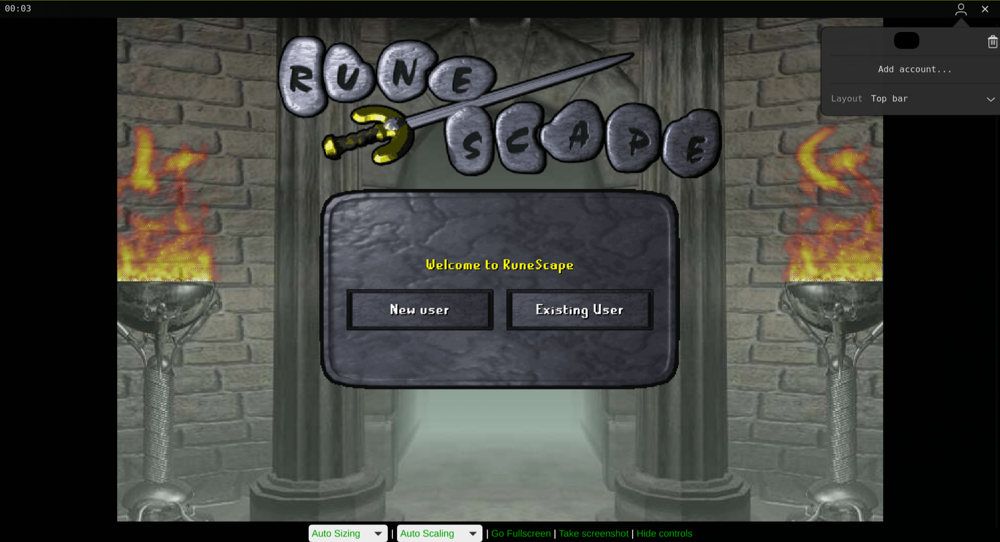

# lostgtk

Minimal GTK4 launcher for the [2004scape / Lost City](https://2004.lostcity.rs) web client.



## About

Playing in a browser tab is rough: it throttles when backgrounded, surrounds the canvas with chrome you don't want, and there's nowhere good to keep alt accounts. `lostgtk` is a frameless WebKitGTK window pointed at the same Lost City client, with the bits a private-server client actually needs:

- saved account list, one click logs in
- AFK timer that resets on any input
- overlay bar you can pin to the top, bottom, or float in a corner
- right-click menu and background-tab throttling turned off

Config lives in `~/.config/lostgtk/`. Passwords sit in plain JSON at `chmod 0600`. This is not a password manager; treat it like a notes file.

## Build

```sh
make            # release build
make sanitize   # asan + ubsan
make run
```

Requires `gtk4`, `webkitgtk-6.0`, `json-glib-1.0`, `pkg-config`.

## Flatpak

```sh
flatpak-builder --user --install --force-clean build-dir rs.lostcity.lostgtk.yaml
flatpak run rs.lostcity.lostgtk
```

## Tags

`runescape` `2004scape` `lost-city` `gtk4` `webkitgtk` `linux` `flatpak` `private-server`
